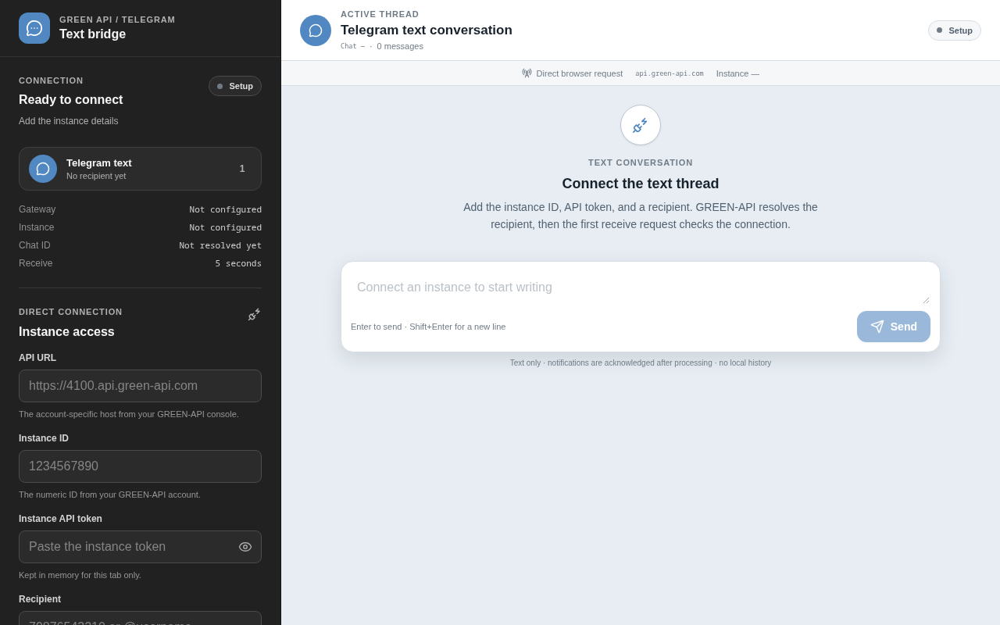
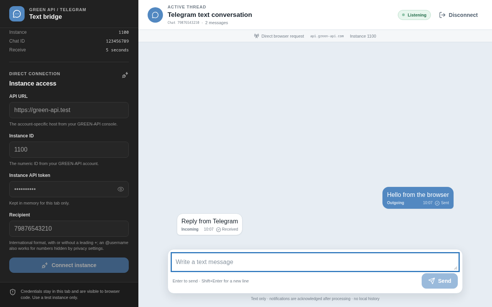
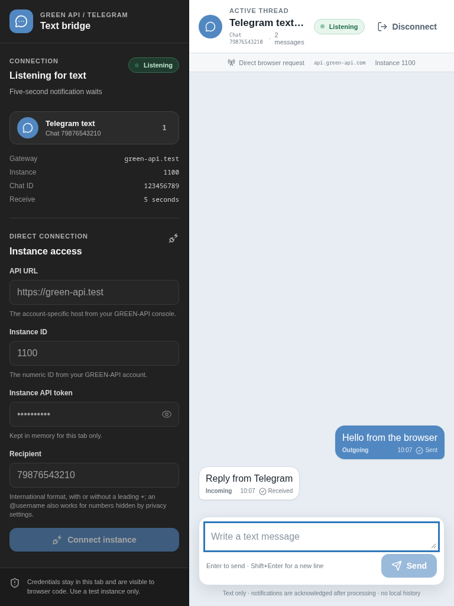
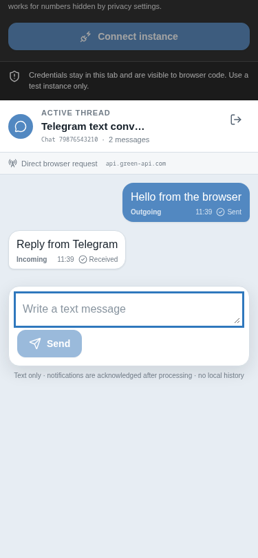

# GREEN API Telegram Chat Prototype

A browser-only React/TypeScript prototype for one text-only Telegram conversation through a dedicated [GREEN-API Telegram instance](https://green-api.com/telegram/docs/). The browser sends messages, polls incoming notifications, and acknowledges each processed notification. It is for local development and manual verification, not production.

## Important security warning

This prototype has **no backend proxy**. The GREEN-API API URL, instance ID, and instance API token are used by browser code, so they can be seen in browser memory, developer tools, and network requests. Anyone who can inspect the running page or capture its traffic may be able to reuse the credentials.

Never commit credentials, hardcode them in source, or treat a static build as a secure way to hide them. Use a real instance only for testing. A production version needs a server-side credential store and a backend that performs API calls.

Direct browser requests also depend on CORS. If the browser blocks a request because of CORS, React cannot bypass that restriction. This prototype has no server-side proxy, alternative request transport, or CORS workaround.

## Quick start

```bash
bun install
bunx playwright install chromium
bun run dev
```

`bun run dev` serves the app on `http://127.0.0.1:5173`. Open that URL and fill in the setup form with the API URL, instance ID, instance API token, and recipient. [Prerequisites](#prerequisites) explains what each value must look like, and [Manual verification](#manual-verification) is the full end-to-end check.

The `playwright install` step downloads the Chromium build used by `bun run test:e2e` and by the screenshot capture script. Skipping it leaves the development server, the unit tests, and the production build working.

## Screenshots

The setup form collects the API URL, instance ID, instance API token, and a recipient that GREEN-API resolves to a chat ID.



The connected thread, showing an outgoing message that reached `Sent` and an incoming reply that was acknowledged.



The same thread at the two narrower widths the layout rules cover.

| 768px | 375px |
| --- | --- |
|  |  |

Screenshots are captured from the production build with mocked GREEN-API routes, so no live instance is used. Regenerate them after a UI change with `bun run build`, start `bun run preview --host 127.0.0.1 --port 4173`, then run `bun scripts/capture-screenshots.ts`. The dev server is not suitable: it injects a debug toolbar into every capture.

## Prerequisites

- Bun 1.3.14 or a compatible newer Bun release
- A GREEN-API Telegram account and an active Telegram instance
- The account-specific `apiUrl` shown in the GREEN-API console, for example `https://4100.api.green-api.com`. It must start with `https://`; a plain `http://` value is rejected before any request is sent
- The instance ID and instance API token
- A Telegram recipient the instance is allowed to message: a phone number in international format, digits only, with an optional leading `+` that the client strips, or an `@username` for accounts hidden by privacy settings
- A browser and network connection that permit direct HTTPS requests to the configured GREEN-API host

Bun is the runtime and package manager for this project. Node and pnpm are not required.

## Commands

```bash
bun install
bunx playwright install chromium
bun run dev
bun run test
bun run test:e2e
bun run typecheck
bun run lint
bun run build
bun run preview
```

Use `bun run dev` to start the local development server, `bun run test` to run the unit tests, `bun run test:e2e` to run the Playwright browser test, `bun run typecheck` to run TypeScript without emitting files, `bun run lint` to run Biome checks, `bun run build` to create a production build, and `bun run preview` to serve that build locally on `127.0.0.1:4173`.

`bun run test:e2e` needs a Chromium build that matches the installed Playwright version. Run `bunx playwright install chromium` once after installing dependencies, and again whenever Playwright is upgraded. The command starts its own development server on `127.0.0.1:5173` and drives the app in a real browser with mocked GREEN-API routes, so it never contacts a live instance.

## GREEN-API Telegram request flow

The client uses the account-specific API URL from the GREEN-API console. Do not replace it with a generic WhatsApp host. The request path shape is:

```text
{{apiUrl}}/waInstance{{idInstance}}/{{method}}/{{apiTokenInstance}}
```

For example, with `apiUrl=https://4100.api.green-api.com`, `idInstance=123`, and an instance token:

```text
https://4100.api.green-api.com/waInstance123/sendMessage/{{apiTokenInstance}}
```

The client follows this order:

1. Resolve the recipient with `POST checkAccount`. The recipient is sent as `phoneNumber`, as a number for a phone and as a string for an `@username`:

   ```json
   {
     "phoneNumber": 79876543210
   }
   ```

   A successful response includes `exist: true` and the numeric `chatId` to send to. `exist: false` means Telegram cannot resolve the recipient, and `status: false` means the instance token is not authorized for the method.

2. Send `POST sendMessage` with a JSON body:

   ```json
   {
     "chatId": "123456789",
     "message": "Hello from the browser"
   }
   ```

   A successful response includes an `idMessage` value.

3. Call `GET receiveNotification?receiveTimeout=5`. The GREEN-API notification wait accepts values from 5 to 60 seconds; this prototype uses the minimum five-second wait.

4. Process only incoming text notifications. The relevant response shape is:

   ```json
   {
     "receiptId": 456,
     "body": {
       "typeWebhook": "incomingMessageReceived",
       "timestamp": 1700000000,
       "senderData": {
         "chatId": "123456789",
         "sender": "123456789"
       },
       "messageData": {
         "typeMessage": "textMessage",
         "textMessageData": {
           "textMessage": "Reply from Telegram"
         }
       }
     }
   }
   ```

5. After a notification is processed, acknowledge it with `DELETE deleteNotification/{receiptId}`. The request must return `{ "result": true }`; a failed acknowledgement is treated as a protocol error.

6. Poll `receiveNotification` again. An empty response during the wait is normal and means that no notification arrived during that interval.

The recipient is what the user types, and the client resolves it to the numeric chat ID the Telegram gateway uses. A phone number must be digits only, so `79876543210` and `+79876543210` are both accepted — a leading `+` is stripped before the number is sent — while `+7 (987) 654-32-10` is not, because spaces, parentheses, and dashes are rejected. An `@username` is passed to `checkAccount` unchanged, which is the way to reach an account hidden by privacy settings. WhatsApp-style identifiers such as `987@c.us` are rejected by the client.

A request that fails with HTTP 466 is reported as a plan limit rather than a generic failure: the free GREEN-API plan allows only three active chats, so the chat has to be reused or the plan raised.

## Manual verification

1. Run `bun install`, then `bun run dev`.
2. Open `http://127.0.0.1:5173`, the URL the development server prints.
3. Enter the GREEN-API console `apiUrl`, instance ID, instance API token, and a recipient at runtime. Do not put credentials in source files.
4. Send a short text message and confirm in the browser network panel that the request is `POST .../checkAccount/...` for the recipient first, then `POST .../sendMessage/...` sending `chatId` plus `message` in the JSON body.
5. Confirm that the recipient receives the message, then send a text reply from another Telegram client.
6. Confirm that `GET .../receiveNotification/...?receiveTimeout=5` returns the reply and that the UI reads `body.messageData.textMessageData.textMessage`.
7. Confirm that the processed notification is acknowledged with `DELETE .../deleteNotification/.../{receiptId}` and that the response contains `result: true`.
8. Confirm that another receive poll starts after acknowledgement and that the processed notification is not shown again.
9. Check the browser console and network panel for errors, especially CORS failures.

## Prototype limitations

- Text messages only. Only `incomingMessageReceived` notifications whose `messageData.typeMessage` is `textMessage` are displayed.
- Media, stickers, contacts, locations, polls, and other notification types are not processed.
- One active conversation only; there is no durable history or database.
- No backend proxy, server-side secret storage, user authentication, or tenant isolation.
- No production-grade delivery-status, retry, or reconnect policy.
- Direct browser access may be blocked by CORS.
- API credentials are exposed to the browser and must be treated as compromised.

## Official references

- [GREEN-API Telegram documentation](https://green-api.com/telegram/docs/)
- [Request format](https://green-api.com/telegram/docs/request-format/)
- [Checking an account](https://green-api.com/telegram/docs/api/service/CheckAccount/)
- [Sending messages](https://green-api.com/telegram/docs/api/sending/SendMessage/)
- [Receiving notifications](https://green-api.com/telegram/docs/api/receiving/technology-http-api/ReceiveNotification/)
- [Deleting notifications](https://green-api.com/telegram/docs/api/receiving/technology-http-api/DeleteNotification/)
- [Telegram chat IDs](https://green-api.com/telegram/docs/api/chat-id/)
- [Before starting](https://green-api.com/telegram/docs/before-start/)
- [Important differences](https://green-api.com/telegram/docs/important-differences/)
